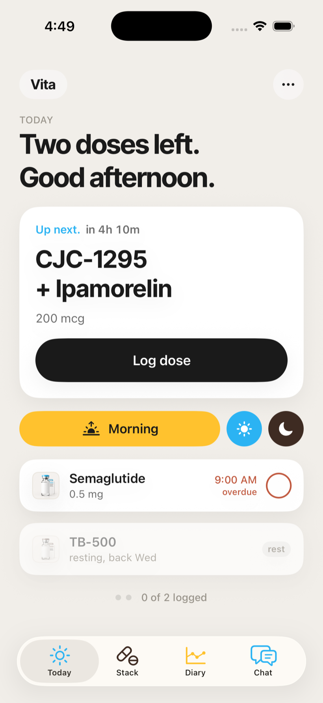
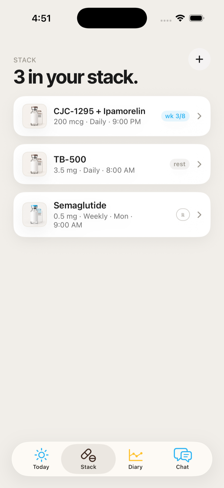
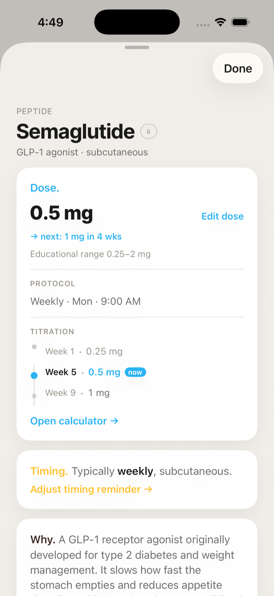
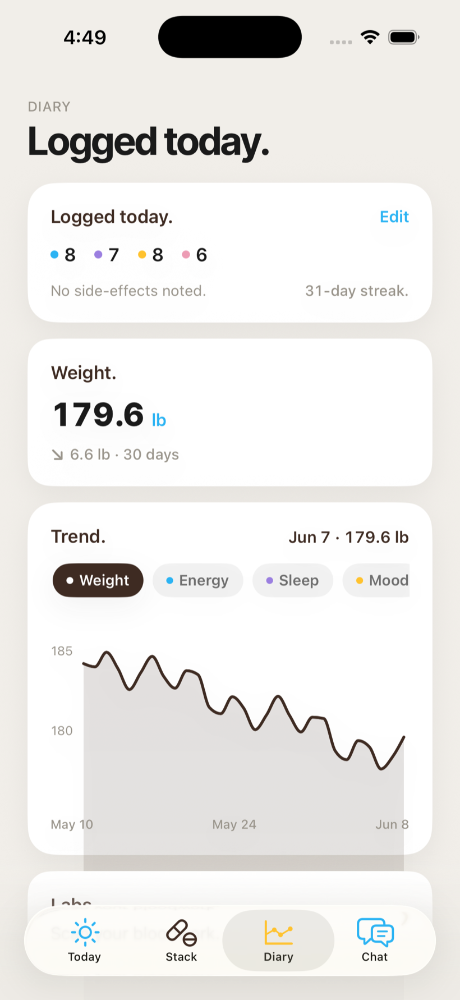
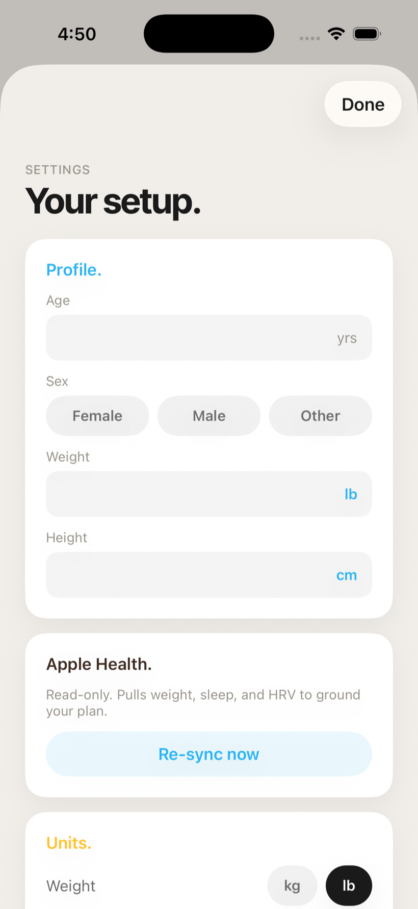
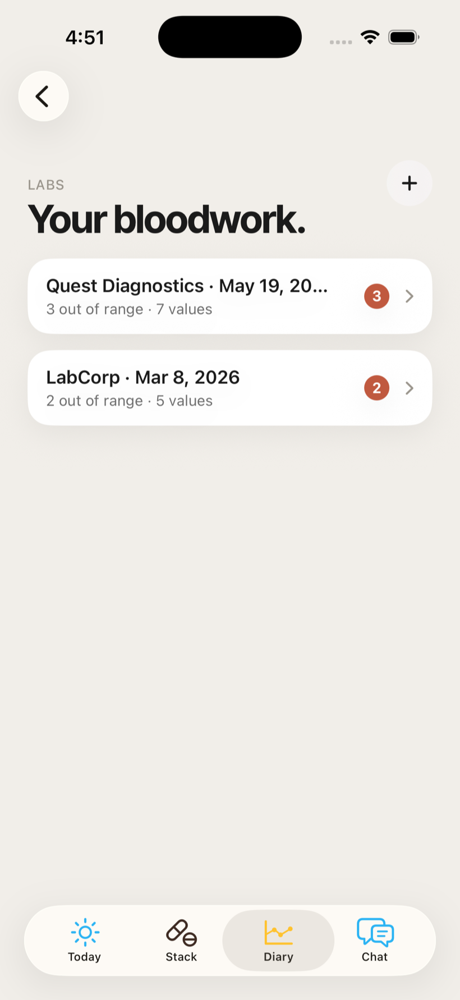

# Vita

**An iOS 26 educational peptide-tracking app.** Pick the compounds you're tracking, learn about them, build a schedule, log doses, keep a diary, read lab work, and ask an AI grounded in your own stack — in a calm, warm, "fields"-inspired interface.

Native SwiftUI · SwiftData · Swift 6 · Claude Opus 4.8 · local-first · light-mode.

> ## ⚠️ Educational only — not medical advice
> Vita is a personal learning + tracking tool, **not** medical advice and **not** a medical device. AI suggestions and every dosing value are *educational ranges*, never instructions, and can be wrong. Many compounds referenced here are prescription-only or regulated and vary by jurisdiction. The bundled catalog is **unverified**. Not affiliated with any vendor. **Consult a licensed clinician.** Full terms in [DISCLAIMER.md](DISCLAIMER.md).

---

## Screenshots

| Today | Stack | Compound detail |
|:---:|:---:|:---:|
|  |  |  |
| **Diary** | **Settings** | **Labs** |
|  |  |  |

*(Simulator captures with demo data.)*

---

## What it does

Four tabs — **Today · Stack · Diary · Chat** — plus labs, a reconstitution calculator, and settings.

- **Today** — a time-adaptive home: a dynamic headline, an "Up next" focus card with a live countdown, an expanding Morning/Midday/Night control, and full-size "pins" you tap to log (the signature north-star tap animation). Streak, day-complete, and rest-day moments; a quiet "as needed" (PRN) card.
- **Stack** — your compounds, each with a detail screen (Dose / Timing / Why) showing the active dose, a cycle ribbon ("On · week 3 of 8"), and a titration ladder. Add from a searchable catalog (~58 compounds, 6 categories) with a prescription (℞) badge on clinician-supervised ones.
- **Scheduling depth** — daily / every-other-day / weekly / as-needed, plus **cycles** (on/off blocks that rest and never go overdue) and **titration** (dose stepping over time), all derived live (no event materialization).
- **Diary** — a daily check-in on a signature 1–10 slider (energy/sleep/mood/libido) + side-effects + note, weight & measurements (with Apple Health backfill), and a Swift Charts trend with drag-scrub.
- **Chat** — a streaming assistant grounded in your stack, goals, profile, Health, diary, and labs; it can suggest stack changes you confirm in a sheet.
- **Labs** — scan a photo or PDF of bloodwork; Claude vision reads the values; review and save panels with high/low flags and a "vs last" delta.
- **Reconstitution calculator** — "draw to X units" (U-100/50/40), mg↔IU, with calm warnings.
- **Notifications** — local dose reminders, actionable from the lock screen (Log / Skip / Snooze), that disappear once a dose is logged.
- **AI protocol generation** — onboarding turns your goals + picks into a starter stack via Claude (with a rule-based fallback when offline / no key).

See **[ARCHITECTURE.md](ARCHITECTURE.md)** for how it's built and **[ROADMAP.md](ROADMAP.md)** for status + what's next.

---

## Tech stack

- **iOS 26**, SwiftUI, **Swift 6** (strict concurrency), Xcode 26. Light mode only (tokens are dark-ready).
- **SwiftData** local-first store (CloudKit-legal models; sync designed but not yet enabled).
- **[XcodeGen](https://github.com/yonohub/XcodeGen)** — the `.xcodeproj` is generated from `project.yml` (and gitignored).
- **Claude Opus 4.8** via the Anthropic Messages API (raw `URLSession`, no SDK): forced tool-use for structured output, vision for labs, SSE streaming for chat.
- **HealthKit** (read-only), **Swift Charts**, **PDFKit**, local **UserNotifications**.
- ~16k lines of Swift, **321 unit tests** (pure-logic engines + services).

---

## Quickstart

**Requirements:** macOS with **Xcode 26** (iOS 26 SDK), and [XcodeGen](https://github.com/yonohub/XcodeGen) (`brew install xcodegen`).

```bash
git clone https://github.com/advegaf/vita.git
cd vita

# 1. Set up local config (key + signing team — both optional for the simulator)
cp Config/Secrets.example.xcconfig Config/Secrets.xcconfig
#   edit Config/Secrets.xcconfig — see CONTRIBUTING.md

# 2. Generate the Xcode project
xcodegen generate

# 3a. Build + run the tests on a simulator (no key or signing needed)
xcodebuild -project Vita.xcodeproj -scheme Vita \
  -destination 'platform=iOS Simulator,name=iPhone 17 Pro' test

# 3b. Or open and run
open Vita.xcodeproj
```

**The app runs with no API key** — onboarding falls back to a rule-based starter stack, and you can explore every screen. AI features (protocol generation, chat, lab reading) need an Anthropic key in `Config/Secrets.xcconfig`. Building for a **physical device** needs your Apple Developer Team ID (also in `Secrets.xcconfig`) — see **[CONTRIBUTING.md](CONTRIBUTING.md)**.

---

## Handoff / Start here

If you're picking this up:

1. **Read [ARCHITECTURE.md](ARCHITECTURE.md)** — it maps the layers and where everything lives (the data layer, the Claude integration, the design system, the scheduling engine).
2. **Skim [ROADMAP.md](ROADMAP.md)** — what's shipped (milestones M0–M10.1) and the prioritized backlog (next up: **M11 — lab marker-over-time trend charts**).
3. **Build it on the simulator first** (no key/signing needed) to see it run, then wire your own Anthropic key + signing team for the full experience.
4. **`CLAUDE.md` / `AGENTS.md`** capture the build loop, conventions, and gotchas — if you continue with an AI coding agent (this project was built with one), point it there first.
5. Good first tasks are filed as **GitHub issues** (M11, CI, an SPM module split, an a11y pass, a distribution/proxy path).

---

## License

MIT — see [LICENSE](LICENSE). Bundled Inter Tight font under SIL OFL 1.1. Educational-use disclaimer in [DISCLAIMER.md](DISCLAIMER.md).
