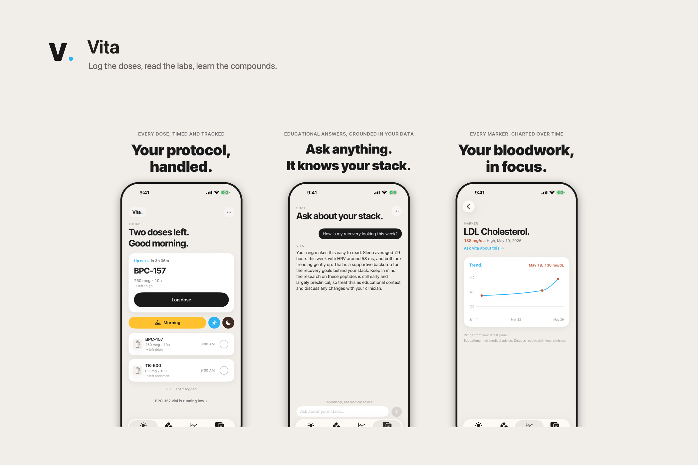
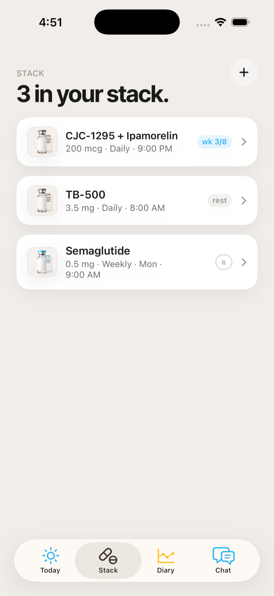
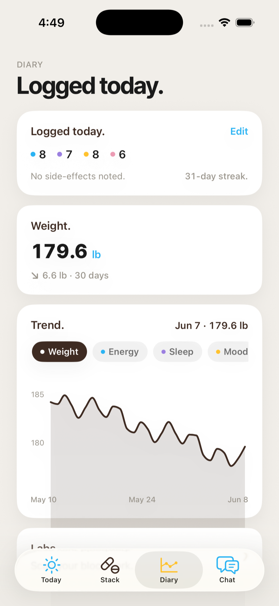

<p align="center">
  
</p>

<h1 align="center">Vita</h1>

<p align="center">
  An educational peptide tracking app for iPhone. Build a schedule, log the doses against it, keep a diary, read your bloodwork, and ask an assistant that already has your own stack in front of it.
</p>

<p align="center">
  
</p>

<p align="center">
  <sub>Build it yourself. iPhone, iOS 26. Local first, no account.</sub>
</p>

> **Educational only. This is not medical advice.**
>
> Vita is a personal learning and tracking tool. It is not medical advice and it
> is not a medical device. Every AI suggestion and every dosing value in it is an
> educational range rather than an instruction, and any of them can be wrong.
> Many of the compounds it references are prescription only or otherwise
> regulated, and which ones varies by where you are. The bundled catalogue is
> unverified. Vita is not affiliated with any vendor. Talk to a licensed
> clinician. Full terms are in [DISCLAIMER.md](DISCLAIMER.md).

Four tabs, Today, Stack, Diary and Chat, plus labs, a reconstitution calculator
and settings.

**Today** is time adaptive: a headline that changes through the day, an Up next
card with a live countdown, a Morning, Midday and Night control that expands,
and full size pins you tap to log. Streaks, a day complete moment, rest days,
and a quiet card for the as needed doses that do not belong to a schedule.

<p align="center">
  
</p>

**Stack** is your compounds, each with a detail screen split into Dose, Timing
and Why, showing the active dose, a cycle ribbon reading something like "On,
week 3 of 8", and a titration ladder. You add from a searchable catalogue of
about 58 compounds in 6 categories, and the ones a clinician should be
supervising carry a prescription badge.

Scheduling goes deeper than daily. Every other day, weekly and as needed, plus
cycles, which are on and off blocks that rest rather than going overdue, and
titration, which steps a dose over time. All of it is derived live rather than
materialised into events, so changing a schedule does not leave a trail of stale
rows behind it.

<p align="center">
  
</p>

**Diary** is a daily check in on a 1 to 10 slider for energy, sleep, mood and
libido, with side effects and a note, plus weight and measurements that backfill
from Apple Health, and a Swift Charts trend you can drag to scrub.

**Chat** is a streaming assistant grounded in your stack, goals, profile, Health
data, diary and labs. It can propose changes to your stack, which you confirm in
a sheet rather than having applied for you.

**Labs** takes a photo or a PDF of bloodwork, reads the values with Claude's
vision, and saves panels with high and low flags and a delta against the last
one.

The reconstitution calculator answers "draw to X units" for U-100, U-50 and
U-40, converts mg and IU, and warns quietly rather than shouting. Dose reminders
are local notifications you can act on from the lock screen with Log, Skip or
Snooze, and they disappear once the dose is logged. Onboarding turns your goals
and picks into a starter stack through Claude, falling back to a rule based one
when there is no key or no network.

## Build it yourself

Requires macOS with Xcode 26 (the iOS 26 SDK) and
[XcodeGen](https://github.com/yonaskolb/XcodeGen).

```sh
git clone https://github.com/advegaf/vita.git
cd vita

cp Config/Secrets.example.xcconfig Config/Secrets.xcconfig
xcodegen generate

xcodebuild -project Vita.xcodeproj -scheme Vita \
  -destination 'platform=iOS Simulator,name=iPhone 17 Pro' test
```

`Vita.xcodeproj` is generated and gitignored, so a fresh clone has nothing to
open until `xcodegen generate` has run.

**It runs with no API key.** Onboarding falls back to a rule based starter stack
and every screen is reachable. The AI parts, protocol generation, chat and lab
reading, need an Anthropic key in `Config/Secrets.xcconfig`. Building for a
physical device needs your Apple Developer team id in the same file. See
[CONTRIBUTING.md](CONTRIBUTING.md).

`Tools/Screenshots/ArticleImages.swift` regenerates the images on this page from
the App Store frames in `marketing/appstore`, which it leaves alone.

## How it is built

iOS 26, SwiftUI, Swift 6 under strict concurrency, Xcode 26. Light mode only,
though the tokens are ready for dark. SwiftData is the local first store, with
CloudKit legal models and sync designed but not turned on.

Claude Opus 4.8 through the Anthropic Messages API over raw `URLSession` with no
SDK: forced tool use for structured output, vision for the lab photos, and SSE
streaming for chat. HealthKit read only, Swift Charts, PDFKit, and local
notifications.

324 unit tests and 8 UI tests, with no third party runtime dependencies.

I built it with Claude Code and Codex working like a small team. One agent plans the work and
writes a spec for each piece, subagents write the code from those specs, and the two tools review
each other's changes. I approve the plan before any code gets written, I read every diff before
it's committed, and nothing ships until the tests pass. Anything that touches security or user
data I write or check line by line myself.

[ARCHITECTURE.md](ARCHITECTURE.md) maps the layers and says where everything
lives: the data layer, the Claude integration, the design system, the scheduling
engine. [ROADMAP.md](ROADMAP.md) has what has shipped, milestones M0 through
M10.1, and what is next, which is M11, lab marker trend charts over time.

If you are picking this up, build it on the simulator first, with no key and no
signing, to see it run. `CLAUDE.md` and `AGENTS.md` carry the build loop, the
conventions and the gotchas, and since this project was built with coding agents,
point yours there first. Good first tasks are filed as GitHub issues.

## Credit

Built by [Angel Vega](https://github.com/advegaf).

## Licence

MIT. See [LICENSE](LICENSE). The bundled Inter Tight font is under the SIL Open
Font License 1.1. The educational use disclaimer is in
[DISCLAIMER.md](DISCLAIMER.md).
